# Polyglot Codebase Knowledge Graph

> Generated offline by **readmenator**. Supports C, C++, Python, Go, Rust, JS/TS, Java, C#, Shell, PHP, Dart, GDScript, Nim, ASM.
> No LLMs. No tokens. Pure static analysis. See more [here](https://github.com/grisuno/ReadMenator)

**Total Files Parsed:** 2 | **Total Symbols Extracted:** 29 | **Total Imports:** 9

## Structural Knowledge Map

```mermaid
graph TD
    classDef mod fill:#1e1e1e,stroke:#ff6666,stroke-width:2px,color:#fff;
    classDef cls fill:#2d2d2d,stroke:#4ec9b0,stroke-width:2px,color:#fff;
    classDef fn fill:#333,stroke:#dcdcaa,stroke-width:1px,color:#dcdcaa;
    classDef ext fill:#111,stroke:#666,stroke-dasharray:5 5,color:#aaa;
    app_py["app.py (py)"]
    class app_py mod;
    app_py_measure_spatial_richness["measure_spatial_richness"]
    class app_py_measure_spatial_richness fn;
    app_py --> app_py_measure_spatial_richness
    app_py_HomeostasisEngine["HomeostasisEngine"]
    class app_py_HomeostasisEngine cls;
    app_py --> app_py_HomeostasisEngine
    app_py_LiquidNeuron["LiquidNeuron"]
    class app_py_LiquidNeuron cls;
    app_py --> app_py_LiquidNeuron
    app_py_ConsciousSystem["ConsciousSystem"]
    class app_py_ConsciousSystem cls;
    app_py --> app_py_ConsciousSystem
    app_py_NestedTopoLayer["NestedTopoLayer"]
    class app_py_NestedTopoLayer cls;
    app_py --> app_py_NestedTopoLayer
    install_sh["install.sh (sh)"]
    class install_sh mod;
    ext_torch["torch"]
    class ext_torch ext;
    app_py -.->|imports| ext_torch
    ext_torch_nn["torch.nn"]
    class ext_torch_nn ext;
    app_py -.->|imports| ext_torch_nn
    ext_torch_nn_functional["torch.nn.functional"]
    class ext_torch_nn_functional ext;
    app_py -.->|imports| ext_torch_nn_functional
    ext_torch_optim["torch.optim"]
    class ext_torch_optim ext;
    app_py -.->|imports| ext_torch_optim
    ext_torchvision["torchvision"]
    class ext_torchvision ext;
    app_py -.->|imports| ext_torchvision
    ext_torch_utils_data["torch.utils.data"]
    class ext_torch_utils_data ext;
    app_py -.->|imports| ext_torch_utils_data
    ext_numpy["numpy"]
    class ext_numpy ext;
    app_py -.->|imports| ext_numpy
    ext_pathlib["pathlib"]
    class ext_pathlib ext;
    app_py -.->|imports| ext_pathlib
    ext_json["json"]
    class ext_json ext;
    app_py -.->|imports| ext_json
```

---

## Architecture Reference

### PY (1 files)

#### `app.py`
**Path:** `app.py`

**Classes:**
- `HomeostasisEngine` (line 42) `class HomeostasisEngine`
- `LiquidNeuron` (line 69) `class LiquidNeuron` - *Neurona con fast weights hebbianos (de Síntesis)*
- `ConsciousSystem` (line 120) `class ConsciousSystem` - *Sistema de control ejecutivo que opera sobre representaciones
del sistema inconsciente. Implementa homeostasis y memoria de trabajo.*
- `NestedTopoLayer` (line 183) `class NestedTopoLayer` - *Capa de procesamiento topológico con memoria episódica.
Versión simplificada de TopoBrain enfocada en representaciones ricas.*
- `UnconsciousSystem` (line 229) `class UnconsciousSystem` - *Sistema inconsciente: Procesamiento automático y paralelo.
Arquitectura simplificada de TopoBrain para extracción de features.*
- `DualMind` (line 291) `class DualMind` - *Sistema dual de procesamiento:
- Inconsciente: Procesamiento automático, paralelo, topológico
- Consciente: Decisión deliberada, homeostática, serial*

**Functions:**
- `measure_spatial_richness` (line 27) `def measure_spatial_richness(activations)` - *Mide diversidad de representaciones mediante eigenspectro*
- `train_dualmind_phase1` (line 358) `def train_dualmind_phase1(model, train_loader, optimizer, device, epochs)` - *FASE 1: Preentrenamiento del sistema inconsciente
Objetivo: Aprender representaciones topológicas ricas*
- `train_dualmind_phase2` (line 413) `def train_dualmind_phase2(model, train_loader, optimizer, device, epochs)` - *FASE 2: Entrenamiento del sistema consciente
Objetivo: Aprender decisiones homeostáticas óptimas
Sistema inconsciente CONGELADO*
- `train_dualmind_phase3` (line 499) `def train_dualmind_phase3(model, train_loader, optimizer, device, epochs)` - *FASE 3: Co-adaptación de ambos sistemas
Objetivo: Refinamiento conjunto con retroalimentación*
- `evaluate_dualmind` (line 591) `def evaluate_dualmind(model, test_loader, device)` - *Evaluación del sistema dual*
- `run_dualmind_experiment` (line 616) `def run_dualmind_experiment()`
- `__init__` (line 43) `def __init__(self)`
- `decide` (line 47) `def decide(self, task_loss_val, richness_val, vn_entropy_val)` - *Motor de decisión homeostática con targets realistas y pesos equilibrados.
- target_entropy=1.8: Valor alcanzable dentro del rango [0, log(10)=2.3]
- target_richness=85.0: Por encima del estado inicial (66-74) para activar exploración
- Pesos reducidos para evitar dominancia de un solo drive*
- `__init__` (line 71) `def __init__(self, in_dim, out_dim)`
- `forward` (line 79) `def forward(self, x, plasticity_gate)` - *Neurona con plasticidad hebbiana de fast weights y decaimiento activación.
Incluye estabilización mediante decaimiento temporal de W_fast.*
- `consolidate_svd` (line 101) `def consolidate_svd(self, repair_strength)` - *Consolidación mediante SVD (modo sueño)*
- `__init__` (line 125) `def __init__(self, unconscious_dim, d_hid, d_out)`
- `forward` (line 148) `def forward(self, unconscious_features, plasticity_gate)` - *Input: Representaciones del sistema inconsciente [batch, unconscious_dim]
Output: logits, métricas homeostáticas*
- `get_structure_entropy` (line 169) `def get_structure_entropy(self)` - *Análisis de salud estructural mediante SVD*
- `__init__` (line 188) `def __init__(self, in_dim, hid_dim, num_nodes)`
- `forward` (line 200) `def forward(self, x_nodes, plasticity_gate)` - *x_nodes: [batch, num_nodes, in_dim]
output: [batch, num_nodes, hid_dim]*
- `get_topology_density` (line 221) `def get_topology_density(self)` - *Densidad de conexiones topológicas*
- `__init__` (line 234) `def __init__(self, in_channels, grid_size, hidden_dim)`
- `forward` (line 258) `def forward(self, x, plasticity_gate)` - *x: [batch, 3, 32, 32]
output: [batch, output_dim] representaciones inconscientes*
- `get_topology_stats` (line 276) `def get_topology_stats(self)` - *Estadísticas de topología del sistema inconsciente*
- `__init__` (line 297) `def __init__(self, in_channels, grid_size, hidden_dim, conscious_dim, num_classes)`
- `forward` (line 317) `def forward(self, x, mode)` - *Modos de operación:
- 'unconscious': Solo sistema inconsciente (rápido, baseline)
- 'conscious': Consciente sobre inconsciente (lento, preciso)
- 'dual': Ambos con retroalimentación (modo completo)*
- `get_system_status` (line 343) `def get_system_status(self)` - *Diagnóstico completo del sistema dual*

### SH (1 files)

#### `install.sh`
**Path:** `install.sh`

*No symbols extracted*
