# Polyglot Codebase Knowledge Graph

> Generated offline by **readmenator**. 2 files, 29 symbols, 9 imports. Supports C, C++, Python, Go, Rust, JS/TS, Java, C#, Shell, PHP, Dart, GDScript, Nim, ASM, Ruby, Swift, Kotlin, Scala, Lua, Elixir.
> No LLMs. No tokens. Pure static analysis. See more [here](https://github.com/grisuno/ReadMenator)

**Start here:** Statistics Dashboard for scope, God Nodes for blast radius, Architecture Reference for per-file API. Agents: prefer `readmenator-agent/INDEX.md` + `SYMBOLS.md`.

**Wiki:** prefer `readmenator-wiki/index.md` for progressive disclosure: one synthesis page per community, `connections.json` with EXTRACTED vs INFERRED confidence, `queries.md` log, `REPORT.md` audit.

**Confidence:** EXTRACTED = parsed from source, INFERRED = heuristic bridge, AMBIGUOUS = reported, never hidden. See `readmenator-wiki/REPORT.md`.

**Total Files Parsed:** 2 | **Total Symbols Extracted:** 29 | **Total Imports:** 9

<!-- ranking_model: v1.0 | weights: {ppr:0.45,auth:0.2,test:0.15,doc:0.1,fresh:0.1} | alpha:0.85 | commit:1e0fd0b | date:2026-07-18 -->


## Table of Contents

1. [Statistics Dashboard](#statistics-dashboard)
2. [Architectural Layers](#architectural-layers)
3. [Ranked Context](#ranked-context)
4. [God Nodes](#god-nodes)
5. [Suggested Questions](#suggested-questions)
6. [Hotspot Analysis](#hotspot-analysis)
7. [Change Impact Analysis](#change-impact-analysis)
8. [Suggested Linting Rules](#suggested-linting-rules)
9. [Orphans](#orphans)
10. [Query Recipes](#query-recipes)
11. [Structural Knowledge Map](#structural-knowledge-map)
12. [UML Class Diagram](#uml-class-diagram)
13. [Code Property Graph](#code-property-graph)
14. [Architecture Reference](#architecture-reference)
    - [PY (1 files)](#py-1-files)
    - [SH (1 files)](#sh-1-files)

---

## Statistics Dashboard

| Metric | Value |
|--------|-------|
| Total Files | 2 |
| Total Symbols | 29 |
| Total Imports | 9 |
| Call Edges | 272 |
| Inheritance Edges | 6 |
| Languages | 2 |
| Avg Symbols/File | 14.5 |
| Avg Imports/File | 4.5 |

### Top Files by Import Count (Fan-Out)

| File | Imports | Symbols | Language |
|------|---------|---------|----------|
| `app.py` | 9 | 29 | py |

---

## Architectural Layers

Auto-detected from path patterns, naming conventions, and imported frameworks.

| Layer | Files |
|-------|-------|
| utility | 2 |

### utility

- `app.py` (py, 29 symbols)
- `install.sh` (sh, 0 symbols)

---

## Ranked Context

Files ranked by composite score for the current query context. The ranking combines Personalized PageRank (query relevance), global authority, test coverage, documentation coverage, and code freshness. Model: v1.0.

| Rank | File | Composite | PPR | Authority | Test | Doc |
|------|------|-----------|-----|-----------|------|-----|
| 1 | `app.py` | 0.0759 | 0.0000 | 0.0000 | 0.00 | 0.76 |
| 2 | `install.sh` | 0.0000 | 0.0000 | 0.0000 | 0.00 | 0.00 |

---

## God Nodes

Most architecturally central files ranked by combined import/export degree and symbol richness.

| File | Score | Connections | PageRank |
|------|-------|-------------|----------|
| `app.py` | 2.9 | | 0.0000 |
| `install.sh` | 0.0 | | 0.0000 |

---

## Suggested Questions

Auto-generated exploration prompts based on graph structure:

- What does app.py depend on, and what depends on it? (0 connections)
- What does install.sh depend on, and what depends on it? (0 connections)
- What is HomeostasisEngine in app.py and how is it used?
- What is the overall architecture of this codebase?

---

## Hotspot Analysis

Files ranked by combined complexity (symbol count) and centrality (connection count). High-scoring files are architecturally critical and may need refactoring attention.

| File | Complexity | Centrality | Combined | Symbols | Connections |
|------|-----------|------------|----------|---------|-------------|
| `app.py` | 1.000 | 1.000 | 1.000 | 29 | 9 |
| `install.sh` | 0.000 | 0.000 | 0.000 | 0 | 0 |

---

## Change Impact Analysis

Files sorted by how many other files would be affected if they changed. High-impact files should be changed with caution.

| File | Direct Dependents | Transitive Dependents | Total Impact |
|------|------------------|----------------------|--------------|
| `app.py` | 0 | 0 | 0 |
| `install.sh` | 0 | 0 | 0 |

---

## Suggested Linting Rules

Automatically suggested linting and security rules based on patterns detected in the codebase. These can be exported as Semgrep rules using the `--export-rules` flag.

| Rule ID | Severity | Description | Language | Matches |
|---------|----------|-------------|----------|---------|
| `RM001` | info | Large number of functions in py: 23 total | py | 23 |
| `RM002` | info | Print statement found (consider logging instead) | python | 28 |

---

## Orphans

Files with no documentation or low connectivity. These are candidates for documentation investment or cleanup.

- `install.sh` (0 symbols, no doc)

---

## Query Recipes

Example queries you can run against this knowledge base using the ranking engine:

```
# Find files most relevant to a concept
readmenator query "Where is the import resolver implemented?"

# Rank files by relevance to a topic
readmenator query "How does documentation generation work?"

# Explain why a file ranks highly
readmenator query "explain readmenator/_documentation.py"

# Trace dependency paths with ranked context
readmenator query "path from CLI to exporter"
```

The ranking model uses the following signals:

- **Personalized PageRank** (45% weight): query-specific relevance via seed propagation
- **Global Authority** (20% weight): structural importance via standard PageRank
- **Test Coverage** (15% weight): fraction of symbols referenced in test files
- **Doc Coverage** (10% weight): presence of docstrings and file-level docs
- **Freshness** (10% weight): recent modification activity

Results include score decomposition and justification paths for each ranked item.

---

## Structural Knowledge Map

```mermaid
graph TD
    classDef mod fill:#1e1e1e,stroke:#ff6666,stroke-width:2px,color:#fff;
    classDef cls fill:#2d2d2d,stroke:#4ec9b0,stroke-width:2px,color:#fff;
    classDef fn fill:#333,stroke:#dcdcaa,stroke-width:1px,color:#dcdcaa;
    classDef ext fill:#111,stroke:#666,stroke-dasharray:5 5,color:#aaa;
    app_py["app.py (py)"]
    class app_py mod;
    app_py_measure_spatial_richness["measure_spatial_richness"]
    class app_py_measure_spatial_richness fn;
    app_py --> app_py_measure_spatial_richness
    app_py_HomeostasisEngine["HomeostasisEngine"]
    class app_py_HomeostasisEngine cls;
    app_py --> app_py_HomeostasisEngine
    app_py_LiquidNeuron["LiquidNeuron"]
    class app_py_LiquidNeuron cls;
    app_py --> app_py_LiquidNeuron
    app_py_ConsciousSystem["ConsciousSystem"]
    class app_py_ConsciousSystem cls;
    app_py --> app_py_ConsciousSystem
    app_py_NestedTopoLayer["NestedTopoLayer"]
    class app_py_NestedTopoLayer cls;
    app_py --> app_py_NestedTopoLayer
    install_sh["install.sh (sh)"]
    class install_sh mod;
    ext_torch["torch"]
    class ext_torch ext;
    app_py -.->|imports| ext_torch
    ext_torch_nn["torch.nn"]
    class ext_torch_nn ext;
    app_py -.->|imports| ext_torch_nn
    ext_torch_nn_functional["torch.nn.functional"]
    class ext_torch_nn_functional ext;
    app_py -.->|imports| ext_torch_nn_functional
    ext_torch_optim["torch.optim"]
    class ext_torch_optim ext;
    app_py -.->|imports| ext_torch_optim
    ext_torchvision["torchvision"]
    class ext_torchvision ext;
    app_py -.->|imports| ext_torchvision
    ext_torch_utils_data["torch.utils.data"]
    class ext_torch_utils_data ext;
    app_py -.->|imports| ext_torch_utils_data
    ext_numpy["numpy"]
    class ext_numpy ext;
    app_py -.->|imports| ext_numpy
    ext_pathlib["pathlib"]
    class ext_pathlib ext;
    app_py -.->|imports| ext_pathlib
    ext_json["json"]
    class ext_json ext;
    app_py -.->|imports| ext_json
```



---

## UML Class Diagram

Auto-generated Mermaid class diagram from parsed class-level symbols. Shows classes, structs, interfaces, traits, and their methods with inheritance and dependency relationships.

```mermaid
classDiagram
  class app_py_HomeostasisEngine {
    <<class>>
    +measure_spatial_richness(activations)
    +train_dualmind_phase1(model, train_loader, optimizer, device, epochs)
    +train_dualmind_phase2(model, train_loader, optimizer, device, epochs)
    +train_dualmind_phase3(model, train_loader, optimizer, device, epochs)
    +evaluate_dualmind(model, test_loader, device)
    +run_dualmind_experiment()
    +__init__(self)
    +decide(self, task_loss_val, richness_val, vn_entropy_val)
    +__init__(self, in_dim, out_dim)
    +forward(self, x, plasticity_gate)
  }
  class app_py_LiquidNeuron {
    <<class>>
    +measure_spatial_richness(activations)
    +train_dualmind_phase1(model, train_loader, optimizer, device, epochs)
    +train_dualmind_phase2(model, train_loader, optimizer, device, epochs)
    +train_dualmind_phase3(model, train_loader, optimizer, device, epochs)
    +evaluate_dualmind(model, test_loader, device)
    +run_dualmind_experiment()
    +__init__(self)
    +decide(self, task_loss_val, richness_val, vn_entropy_val)
    +__init__(self, in_dim, out_dim)
    +forward(self, x, plasticity_gate)
  }
  class app_py_ConsciousSystem {
    <<class>>
    +measure_spatial_richness(activations)
    +train_dualmind_phase1(model, train_loader, optimizer, device, epochs)
    +train_dualmind_phase2(model, train_loader, optimizer, device, epochs)
    +train_dualmind_phase3(model, train_loader, optimizer, device, epochs)
    +evaluate_dualmind(model, test_loader, device)
    +run_dualmind_experiment()
    +__init__(self)
    +decide(self, task_loss_val, richness_val, vn_entropy_val)
    +__init__(self, in_dim, out_dim)
    +forward(self, x, plasticity_gate)
  }
  class app_py_NestedTopoLayer {
    <<class>>
    +measure_spatial_richness(activations)
    +train_dualmind_phase1(model, train_loader, optimizer, device, epochs)
    +train_dualmind_phase2(model, train_loader, optimizer, device, epochs)
    +train_dualmind_phase3(model, train_loader, optimizer, device, epochs)
    +evaluate_dualmind(model, test_loader, device)
    +run_dualmind_experiment()
    +__init__(self)
    +decide(self, task_loss_val, richness_val, vn_entropy_val)
    +__init__(self, in_dim, out_dim)
    +forward(self, x, plasticity_gate)
  }
  class app_py_UnconsciousSystem {
    <<class>>
    +measure_spatial_richness(activations)
    +train_dualmind_phase1(model, train_loader, optimizer, device, epochs)
    +train_dualmind_phase2(model, train_loader, optimizer, device, epochs)
    +train_dualmind_phase3(model, train_loader, optimizer, device, epochs)
    +evaluate_dualmind(model, test_loader, device)
    +run_dualmind_experiment()
    +__init__(self)
    +decide(self, task_loss_val, richness_val, vn_entropy_val)
    +__init__(self, in_dim, out_dim)
    +forward(self, x, plasticity_gate)
  }
  class app_py_DualMind {
    <<class>>
    +measure_spatial_richness(activations)
    +train_dualmind_phase1(model, train_loader, optimizer, device, epochs)
    +train_dualmind_phase2(model, train_loader, optimizer, device, epochs)
    +train_dualmind_phase3(model, train_loader, optimizer, device, epochs)
    +evaluate_dualmind(model, test_loader, device)
    +run_dualmind_experiment()
    +__init__(self)
    +decide(self, task_loss_val, richness_val, vn_entropy_val)
    +__init__(self, in_dim, out_dim)
    +forward(self, x, plasticity_gate)
  }
```



---

## Code Property Graph

Machine-readable Code Property Graph (CPG) in JSON-LD format. This block allows AI agents to parse the full structural graph without additional file reads. Compatible with GraphRAG pipelines.

```json
{"@context": "https://schema.org", "analysis": {"communities": [], "god_nodes": [{"node_id": "app.py", "score": 2.9}, {"node_id": "install.sh", "score": 0.0}], "surprising_connections": []}, "edges": [{"confidence": "EXTRACTED", "relation": "imports", "source": "app.py", "target": "torch"}, {"confidence": "EXTRACTED", "relation": "imports", "source": "app.py", "target": "torch.nn"}, {"confidence": "EXTRACTED", "relation": "imports", "source": "app.py", "target": "torch.nn.functional"}, {"confidence": "EXTRACTED", "relation": "imports", "source": "app.py", "target": "torch.optim"}, {"confidence": "EXTRACTED", "relation": "imports", "source": "app.py", "target": "torchvision"}, {"confidence": "EXTRACTED", "relation": "imports", "source": "app.py", "target": "torch.utils.data"}, {"confidence": "EXTRACTED", "relation": "imports", "source": "app.py", "target": "numpy"}, {"confidence": "EXTRACTED", "relation": "imports", "source": "app.py", "target": "pathlib"}, {"confidence": "EXTRACTED", "relation": "imports", "source": "app.py", "target": "json"}], "generator": "readmenator", "metadata": {"edge_count": 287, "file_count": 2, "language_count": 2, "symbol_count": 29}, "nodes": [{"doc": "app.py  Autor: Gris Iscomeback Correo electrónico: grisiscomeback[at]gmail[dot]com Fecha de creación: xx/xx/xxxx Licencia: GPL v3  Descripción:", "id": "app.py", "kind": "module", "label": "app.py", "language": "py", "sha256": "dd3c7879fc848e84", "symbol_count": 29, "symbols": [{"doc": "Mide diversidad de representaciones mediante eigenspectro", "kind": "function", "line": 27, "name": "measure_spatial_richness", "signature": "def measure_spatial_richness(activations)"}, {"kind": "class", "line": 42, "name": "HomeostasisEngine", "signature": "class HomeostasisEngine(Module)"}, {"doc": "Neurona con fast weights hebbianos (de Síntesis)", "kind": "class", "line": 69, "name": "LiquidNeuron", "signature": "class LiquidNeuron(Module)"}, {"doc": "Sistema de control ejecutivo que opera sobre representaciones\ndel sistema inconsciente. Implementa homeostasis y memoria de trabajo.", "kind": "class", "line": 120, "name": "ConsciousSystem", "signature": "class ConsciousSystem(Module)"}, {"doc": "Capa de procesamiento topológico con memoria episódica.\nVersión simplificada de TopoBrain enfocada en representaciones ricas.", "kind": "class", "line": 183, "name": "NestedTopoLayer", "signature": "class NestedTopoLayer(Module)"}, {"doc": "Sistema inconsciente: Procesamiento automático y paralelo.\nArquitectura simplificada de TopoBrain para extracción de features.", "kind": "class", "line": 229, "name": "UnconsciousSystem", "signature": "class UnconsciousSystem(Module)"}, {"doc": "Sistema dual de procesamiento:\n- Inconsciente: Procesamiento automático, paralelo, topológico\n- Consciente: Decisión deliberada, homeostática, serial", "kind": "class", "line": 291, "name": "DualMind", "signature": "class DualMind(Module)"}, {"doc": "FASE 1: Preentrenamiento del sistema inconsciente\nObjetivo: Aprender representaciones topológicas ricas", "kind": "method", "line": 358, "name": "train_dualmind_phase1", "signature": "def train_dualmind_phase1(model, train_loader, optimizer, device, epochs)"}, {"doc": "FASE 2: Entrenamiento del sistema consciente\nObjetivo: Aprender decisiones homeostáticas óptimas\nSistema inconsciente CONGELADO", "kind": "method", "line": 413, "name": "train_dualmind_phase2", "signature": "def train_dualmind_phase2(model, train_loader, optimizer, device, epochs)"}, {"doc": "FASE 3: Co-adaptación de ambos sistemas\nObjetivo: Refinamiento conjunto con retroalimentación", "kind": "method", "line": 499, "name": "train_dualmind_phase3", "signature": "def train_dualmind_phase3(model, train_loader, optimizer, device, epochs)"}, {"doc": "Evaluación del sistema dual", "kind": "method", "line": 591, "name": "evaluate_dualmind", "signature": "def evaluate_dualmind(model, test_loader, device)"}, {"kind": "method", "line": 616, "name": "run_dualmind_experiment", "signature": "def run_dualmind_experiment()"}, {"kind": "method", "line": 43, "name": "__init__", "signature": "def __init__(self)"}, {"doc": "Motor de decisión homeostática con targets realistas y pesos equilibrados.\n- target_entropy=1.8: Valor alcanzable dentro del rango [0, log(10)=2.3]\n- target_richness=85.0: Por encima del estado inicial (66-74) para activar exploración\n- Pesos reducidos para evitar dominancia de un solo drive", "kind": "method", "line": 47, "name": "decide", "signature": "def decide(self, task_loss_val, richness_val, vn_entropy_val)"}, {"kind": "method", "line": 71, "name": "__init__", "signature": "def __init__(self, in_dim, out_dim)"}, {"doc": "Neurona con plasticidad hebbiana de fast weights y decaimiento activación.\nIncluye estabilización mediante decaimiento temporal de W_fast.", "kind": "method", "line": 79, "name": "forward", "signature": "def forward(self, x, plasticity_gate)"}, {"doc": "Consolidación mediante SVD (modo sueño)", "kind": "method", "line": 101, "name": "consolidate_svd", "signature": "def consolidate_svd(self, repair_strength)"}, {"kind": "method", "line": 125, "name": "__init__", "signature": "def __init__(self, unconscious_dim, d_hid, d_out)"}, {"doc": "Input: Representaciones del sistema inconsciente [batch, unconscious_dim]\nOutput: logits, métricas homeostáticas", "kind": "method", "line": 148, "name": "forward", "signature": "def forward(self, unconscious_features, plasticity_gate)"}, {"doc": "Análisis de salud estructural mediante SVD", "kind": "method", "line": 169, "name": "get_structure_entropy", "signature": "def get_structure_entropy(self)"}, {"kind": "method", "line": 188, "name": "__init__", "signature": "def __init__(self, in_dim, hid_dim, num_nodes)"}, {"doc": "x_nodes: [batch, num_nodes, in_dim]\noutput: [batch, num_nodes, hid_dim]", "kind": "method", "line": 200, "name": "forward", "signature": "def forward(self, x_nodes, plasticity_gate)"}, {"doc": "Densidad de conexiones topológicas", "kind": "method", "line": 221, "name": "get_topology_density", "signature": "def get_topology_density(self)"}, {"kind": "method", "line": 234, "name": "__init__", "signature": "def __init__(self, in_channels, grid_size, hidden_dim)"}, {"doc": "x: [batch, 3, 32, 32]\noutput: [batch, output_dim] representaciones inconscientes", "kind": "method", "line": 258, "name": "forward", "signature": "def forward(self, x, plasticity_gate)"}, {"doc": "Estadísticas de topología del sistema inconsciente", "kind": "method", "line": 276, "name": "get_topology_stats", "signature": "def get_topology_stats(self)"}, {"kind": "method", "line": 297, "name": "__init__", "signature": "def __init__(self, in_channels, grid_size, hidden_dim, conscious_dim, num_classes)"}, {"doc": "Modos de operación:\n- 'unconscious': Solo sistema inconsciente (rápido, baseline)\n- 'conscious': Consciente sobre inconsciente (lento, preciso)\n- 'dual': Ambos con retroalimentación (modo completo)", "kind": "method", "line": 317, "name": "forward", "signature": "def forward(self, x, mode)"}, {"doc": "Diagnóstico completo del sistema dual", "kind": "method", "line": 343, "name": "get_system_status", "signature": "def get_system_status(self)"}]}, {"id": "install.sh", "kind": "module", "label": "install.sh", "language": "sh", "sha256": "c907d80fd6734993", "symbol_count": 0, "symbols": []}], "type": "CodePropertyGraph", "version": "1.0"}
```

---

## Architecture Reference

### PY (1 files)

#### `app.py`
**Path:** `app.py`
**File Doc:** *app.py  Autor: Gris Iscomeback Correo electrónico: grisiscomeback[at]gmail[dot]com Fecha de creación: xx/xx/xxxx Licencia: GPL v3  Descripción:*

**Classes:**
- `HomeostasisEngine` (line 42) `class HomeostasisEngine(Module)`
- `LiquidNeuron` (line 69) `class LiquidNeuron(Module)` - *Neurona con fast weights hebbianos (de Síntesis)*
- `ConsciousSystem` (line 120) `class ConsciousSystem(Module)` - *Sistema de control ejecutivo que opera sobre representaciones
del sistema inconsciente. Implementa homeostasis y memoria de trabajo.*
- `NestedTopoLayer` (line 183) `class NestedTopoLayer(Module)` - *Capa de procesamiento topológico con memoria episódica.
Versión simplificada de TopoBrain enfocada en representaciones ricas.*
- `UnconsciousSystem` (line 229) `class UnconsciousSystem(Module)` - *Sistema inconsciente: Procesamiento automático y paralelo.
Arquitectura simplificada de TopoBrain para extracción de features.*
- `DualMind` (line 291) `class DualMind(Module)` - *Sistema dual de procesamiento:
- Inconsciente: Procesamiento automático, paralelo, topológico
- Consciente: Decisión deliberada, homeostática, serial*

**Functions:**
- `measure_spatial_richness` (line 27) `def measure_spatial_richness(activations)` - *Mide diversidad de representaciones mediante eigenspectro*

**Methods:**
- `train_dualmind_phase1` (line 358) `def train_dualmind_phase1(model, train_loader, optimizer, device, epochs)` - *FASE 1: Preentrenamiento del sistema inconsciente
Objetivo: Aprender representaciones topológicas ricas*
- `train_dualmind_phase2` (line 413) `def train_dualmind_phase2(model, train_loader, optimizer, device, epochs)` - *FASE 2: Entrenamiento del sistema consciente
Objetivo: Aprender decisiones homeostáticas óptimas
Sistema inconsciente CONGELADO*
- `train_dualmind_phase3` (line 499) `def train_dualmind_phase3(model, train_loader, optimizer, device, epochs)` - *FASE 3: Co-adaptación de ambos sistemas
Objetivo: Refinamiento conjunto con retroalimentación*
- `evaluate_dualmind` (line 591) `def evaluate_dualmind(model, test_loader, device)` - *Evaluación del sistema dual*
- `run_dualmind_experiment` (line 616) `def run_dualmind_experiment()`
- `__init__` (line 43) `def __init__(self)`
- `decide` (line 47) `def decide(self, task_loss_val, richness_val, vn_entropy_val)` - *Motor de decisión homeostática con targets realistas y pesos equilibrados.
- target_entropy=1.8: Valor alcanzable dentro del rango [0, log(10)=2.3]
- target_richness=85.0: Por encima del estado inicial (66-74) para activar exploración
- Pesos reducidos para evitar dominancia de un solo drive*
- `__init__` (line 71) `def __init__(self, in_dim, out_dim)`
- `forward` (line 79) `def forward(self, x, plasticity_gate)` - *Neurona con plasticidad hebbiana de fast weights y decaimiento activación.
Incluye estabilización mediante decaimiento temporal de W_fast.*
- `consolidate_svd` (line 101) `def consolidate_svd(self, repair_strength)` - *Consolidación mediante SVD (modo sueño)*
- `__init__` (line 125) `def __init__(self, unconscious_dim, d_hid, d_out)`
- `forward` (line 148) `def forward(self, unconscious_features, plasticity_gate)` - *Input: Representaciones del sistema inconsciente [batch, unconscious_dim]
Output: logits, métricas homeostáticas*
- `get_structure_entropy` (line 169) `def get_structure_entropy(self)` - *Análisis de salud estructural mediante SVD*
- `__init__` (line 188) `def __init__(self, in_dim, hid_dim, num_nodes)`
- `forward` (line 200) `def forward(self, x_nodes, plasticity_gate)` - *x_nodes: [batch, num_nodes, in_dim]
output: [batch, num_nodes, hid_dim]*
- `get_topology_density` (line 221) `def get_topology_density(self)` - *Densidad de conexiones topológicas*
- `__init__` (line 234) `def __init__(self, in_channels, grid_size, hidden_dim)`
- `forward` (line 258) `def forward(self, x, plasticity_gate)` - *x: [batch, 3, 32, 32]
output: [batch, output_dim] representaciones inconscientes*
- `get_topology_stats` (line 276) `def get_topology_stats(self)` - *Estadísticas de topología del sistema inconsciente*
- `__init__` (line 297) `def __init__(self, in_channels, grid_size, hidden_dim, conscious_dim, num_classes)`
- `forward` (line 317) `def forward(self, x, mode)` - *Modos de operación:
- 'unconscious': Solo sistema inconsciente (rápido, baseline)
- 'conscious': Consciente sobre inconsciente (lento, preciso)
- 'dual': Ambos con retroalimentación (modo completo)*
- `get_system_status` (line 343) `def get_system_status(self)` - *Diagnóstico completo del sistema dual*

### SH (1 files)

#### `install.sh`
**Path:** `install.sh`

*No symbols extracted*
